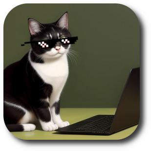

# watchcat

Directory structure monitor and action dispatcher (TUI and CLI). 

## Demo

Demo picture:

<p align="center">
  
</p>

## Features

List of features

  - [ ] xxx

## Tasks

Next:

  - [ ] xxx

Later:

  - [ ] extract `./pkg/gocfg/` into its own repo at `github.com/kraasch/gocfg`.

Done:

  - [ ] xxx

Idea:

### watchconf file example

```text
.                   ezN[ ]
./folderA/          z
./folderA/subA/     ez
./folderA/subB/     ez
./folderB/          zs
./folderB/fileA.txt e
./folderB/fileB.txt z
./folderC/          ez
./folderD/          t(txt,srt,sub,mp4)
./folderE/          t(mp3)
```
## Installation

Install the program:

```bash
go install github.com/kraasch/watchcat@latest
```

Get the package:

```bash
go get github.com/kraasch/watchcat
```

## Usage

Use the program:

```bash
git clone github.com/kraasch/watchcat
cd watchcat/
make build
./build/watchcat -help
```

Use the package:

```go
import (
  "github.com/kraasch/watchcat"
)

watchcat.DoSomething("Hello")
```

## Feedback

I can be reached via [alex@kraasch.eu](mailto:alex@kraasch.eu).

## Contributing

Feel free to help me.

## Acknowledgments

Uses the following software:

  - see [go.mod](./go.mod) and [go.sum](./go.sum).

Made by the following people:

  - see Github info.

## License

View the [license file](./LICENSE).

